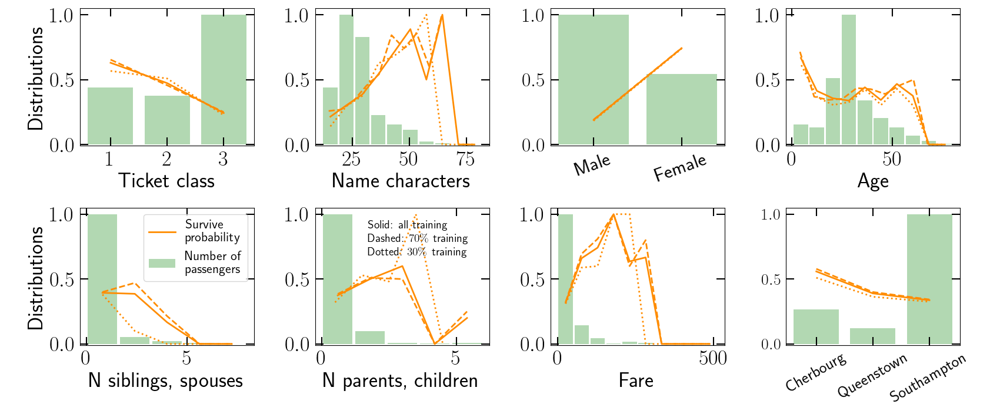
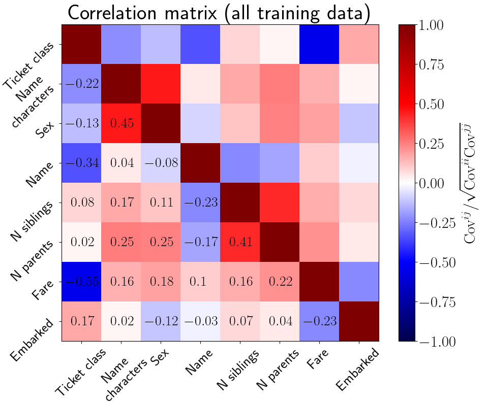

# Titanic_Kaggle_challenge

Simple set of scripts with a simple approach to the famous Kaggle Titanic Challenge. The challenge consists of predicting whether different passengers survive based on characteristics such as age, sex, ticket fare, etc. See the Kaggle website for more details: https://www.kaggle.com/competitions/titanic.

These scripts serve as a basic starting point to explore more elaborate data cleaning and modeling approaches. They compare three different modeling approaches: (i) models built "by hand" after visually inspecting basic data trends, (ii) a dense neural network and (iii) decision tree and random forest classifiers.

## Table of contents
- [Dependencies](#dependencies)
- [Script overview](#script-overview)
- [Data overview](#data-overview)
- [Results overview](#results-overview)

## Dependencies

- numpy, scipy and matplotlib
- pandas
- tensorflow
- scikit-learn

## Script overview

To run the whole pipeline, execute as follows:

*python prepare_training_data.py ; python plot_data_trends.py ; python model_1_byhand.py ; python model_2_dnn.py ; python model_3_trees.py ; python plot_features_importances.py*

#### prepare_training_data.py
This prepares the Kaggle dataset for learning: (i) it numerically encodes features such as gender and embarcation point, (ii) deals with NaN in the data, (iii) constructs new composite features, (iv) splits into 70% training and 30% validation sets.

#### plot_data_trends.py
This plots some basic data trends such as the number of passengers and survive probability as a function of the various features. It plots also the correlation matrix of the features.

#### model_1_byhand.py
This defines a couple of prediction models built by hand from visualy inspecting the basic data trends. Eg., a model where all female survive, or a model where also all male under the age of 9 also survive. It checks the performance of the models on the validation set, and also prepares the file for the Kaggle submission.

#### model_2_dnn.py
This defines a fully connected neural network model, trains it and checks its performance on the validation set. It also prepares the file for the Kaggle submission.

#### model_3_trees.py
This defines a decision tree and random forest classifier models, trains them and check their performance on the validation set. It also prepares the file for the Kaggle submission.

#### plot_features_importances.py
This runs a series of feature importance simulations for the neural network (model_2) and tree-based (model_3) models. The feature importance is worked out by randomizing each of the passenger features; the numerical value of the importance is the inverse of the accuracy degradation after ramdomization.

## Data overview

This figure plots the number of passengers (green bars) and survival probability (orange lines) as a function of the passenger features. The solid, dashed and green orange lines are for the whole data set, the training set and the validation set, respectively.

This figure plots the correlation matrix of the passenger features.

## Results overview

The accuracy of the models on the validation sets are as follows:

By hand model 1 "Save all female"                      : 0.796
By hand model 1 "Save all female and all male age < 9" : 0.799

