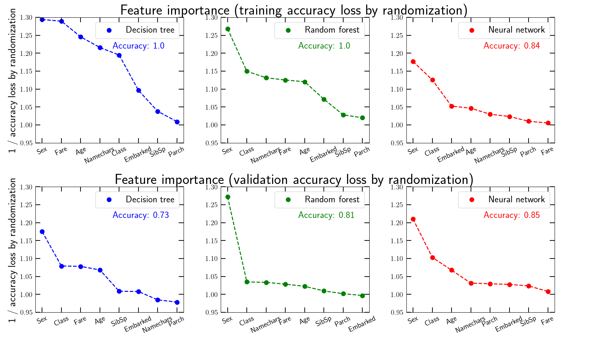

# Titanic_Kaggle_challenge

Set of python scripts with an example approach to the famous Kaggle Titanic Challenge. The challenge consists of predicting whether different passengers survive based on characteristics such as age, sex, ticket fare, etc. See the [Kaggle website](https://www.kaggle.com/competitions/titanic.) for more details.

These scripts serve as a basic starting point to explore more elaborate data cleaning and modeling approaches. They compare three different modeling approaches, namely: 

1. models built "by hand" from visually inspecting basic data trends; 
2. a fully-connected dense neural network;
3. decision tree and random forest classifiers.

## Table of contents
- [Dependencies](#dependencies)
- [Script overview](#script-overview)
- [Data overview](#data-overview)
- [Results overview](#results-overview)

## Dependencies

- numpy, scipy and matplotlib
- pandas
- tensorflow
- scikit-learn

## Script overview

To run the whole pipeline, execute as follows:

*python prepare_training_data.py ; python plot_data_trends.py ; python model_1_byhand.py ; python model_2_dnn.py ; python model_3_trees.py ; python plot_features_importances.py*

#### prepare_training_data.py
This prepares the Kaggle dataset for learning: (i) it numerically encodes features such as gender and embarcation point, (ii) deals with NaN in the data, (iii) engineers new features, (iv) splits into 70% training and 30% validation sets.

#### plot_data_trends.py
This plots some basic data trends such as the number of passengers and survive probability as a function of the various features. It plots also the correlation matrix of the features.

#### model_1_byhand.py
This defines a couple of prediction models built by hand from visually inspecting the basic data trends. Eg., a model where all female survive, or a model where also all male under the age of 9 survive. It checks the performance of the models on the validation set, and also prepares the file for the Kaggle submission.

#### model_2_dnn.py
This defines a fully connected neural network model (4 hidden layers), trains it and checks its performance on the validation set. It also prepares the file for the Kaggle submission.

#### model_3_trees.py
This defines a decision tree and random forest classifier models, trains them and checks their performance on the validation set. It also prepares the file for the Kaggle submission.

#### plot_features_importances.py
This runs a series of feature importance simulations for the neural network (model_2) and tree-based (model_3) models. The feature importance is worked out by randomizing each of the passenger features; the numerical value of the importance is the inverse of the accuracy degradation after randomization.

## Data overview

This figure plots the number of passengers (green bars) and survival probability (orange lines) as a function of the passenger features. The solid, dashed and dotted orange lines are for the whole data set, the training set and the validation set, respectively.

This figure plots the correlation matrix of the passenger features.

## Results overview

The accuracy of the models on the validation set are as follows (note these values may change slightly if trained again):

| Save all female | Same all female and young male | Neural network | Decision tree | Random forest|
| :-------------: | :----------------------------: | :------------: | :-----------: | :----------: |
|      0.796      |              0.799             |      0.839     |     0.681     |     0.803    |  

The neural network is the model that performs the best, followed by the random forest. It is interesting that the simple decision tree could not outperform the basic model saving all female. The model saving all female and young male (age < 9) was inspired by the plot above that shows that children had a higher chance of survival, but this gives only marginal improvement.

The accuracy of the models on the Kaggle test set are as follows:

| Save all female | Same all female and young male | Neural network | Decision tree | Random forest|
| :-------------: | :----------------------------: | :------------: | :-----------: | :----------: |
|      0.766      |              0.766             |      0.801     |     0.665     |     0.739    |  

The situation is similar to the accuracy on the validation set, with the neural network remaining the best model. Overall though, the performance of all models worsens on the test set, compared to the validation set. This may be an indication that the test set is not as representative of the passenger population as the chosen validation set. 

This figure shows the feature importances of the decision tree (blue), random forest (green) and neural network (red). The upper panels show the feature importance measured on the training set, i.e., the accuracy loss on the training set from randomizing each feature. The lower panels show the same for the validation set.

The feature importances of the neural network are very similar in the training and validation sets. This is not the case in the tree-based models. In the training set, there are features with a relatively sizeable importance (eg., fare, age, characters in name for the decision tree model), but this is because the models are overfitting the training data (training accuracy of 1.0). Both tree-based models show a much reduced feature importance on the validation set.

Overall, all models predict that sex is a major predictive factor in the survival probability, followed next by the ticket class. Interestingly, ticket class and ticket fare are two features that are quite anti-correlated (see figure above; if the class decreases from 3rd to 1st, the fare increases), but the neural network assigned nonetheless much more importance to the class than the fare.
